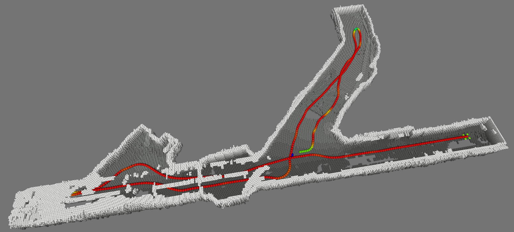
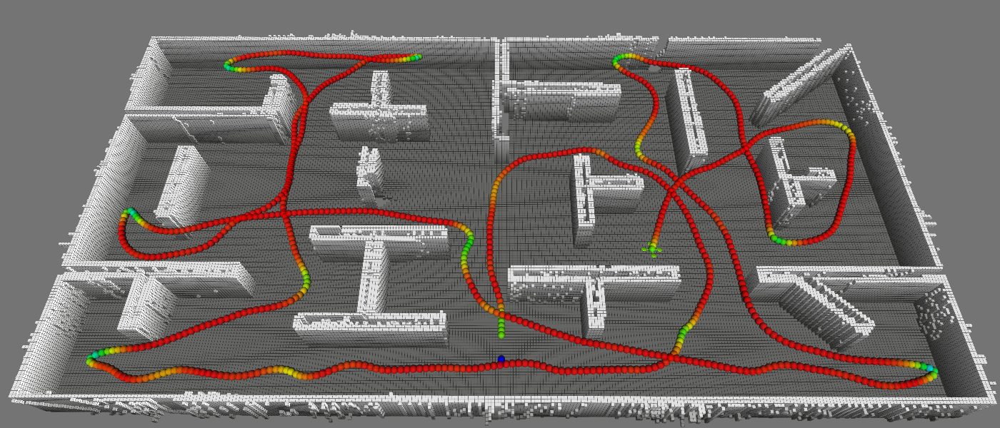
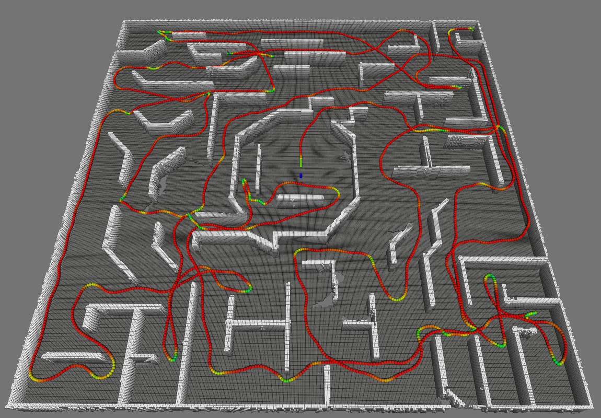
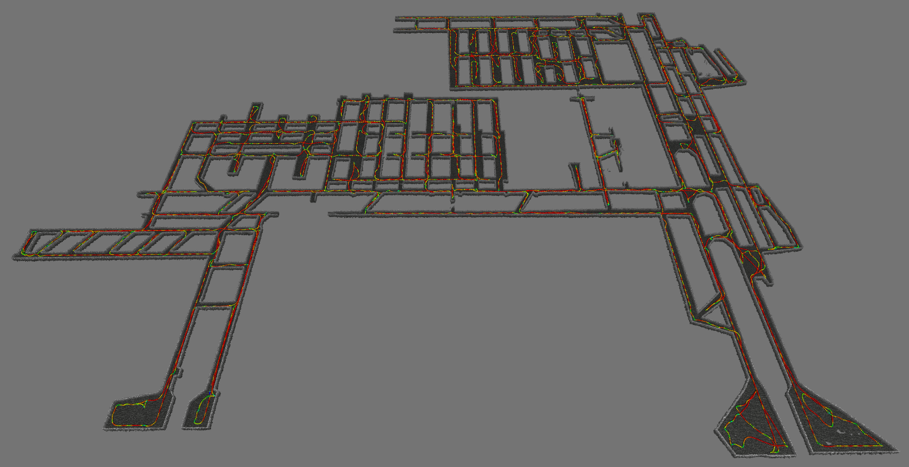
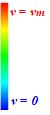
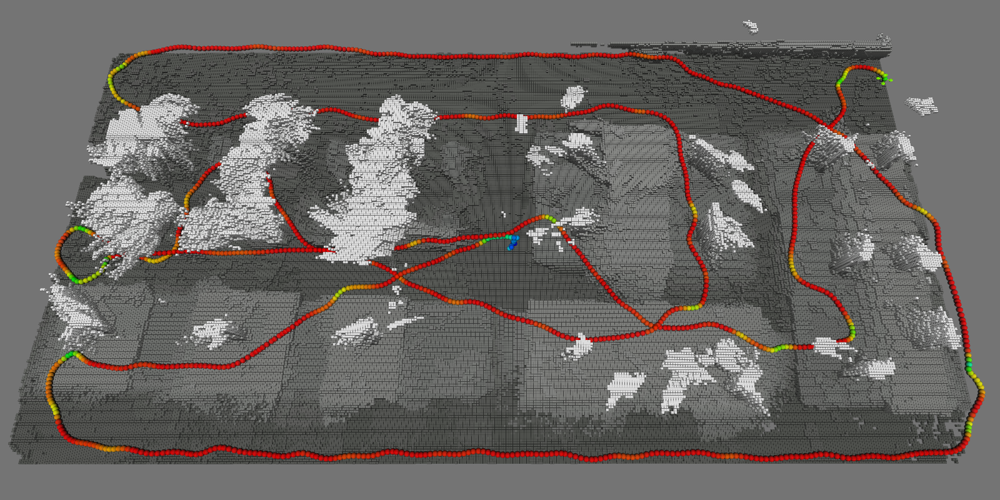

# EDEN: Efficient Dual-Layer Exploration Planning for Fast UAV Autonomous Exploration in Large 3-D Environments

## Code
The code will be released once the paper is accepted.

## Simulations

  
  

  
  
  

## Real-World Exploration

  
  

## Acknowledgements
We are also inspired by [Faster](https://github.com/mit-acl/faster), and proposed ASEO (aggressive and safe exploration-oriented) trajectory in [MINCO](https://github.com/ZJU-FAST-Lab/GCOPTER.git) form. We also adopt dynamical topological graph [DTG](https://github.com/NKU-MobFly-Robotics/GVP-MREP) for planning.
