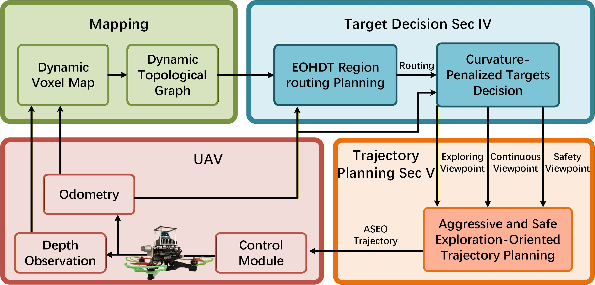

<div align="center">
  <h1>EDEN: Efficient Dual-Layer Exploration Planning for Fast UAV Autonomous Exploration in Large 3-D Environments</h1>
    <strong>IEEE TRANSACTIONS ON INDUSTRIAL ELECTRONICS</strong>

<a href="https://github.com/charlie-dog" target="_black">Qianli Dong</a>,
<a  target="_black">Xuebo Zhang</a>,
<a href="https://github.com/shiyong-zhang" target="_black">Shiyong Zhang</a>,
<a href="https://github.com/wzya112" target="_black">Ziyu Wang</a>,
<a href="https://github.com/Ma-Phil" target="_black">Zhe Ma</a>,
<a href="https://github.com/littlelittle-bo" target="_black">Haobo Xi</a>

<!-- <a href="https://ieeexplore.ieee.org/document/3639779"></a> -->
<a href="https://arxiv.org/pdf/2506.05106"></a>
<a href="https://www.bilibili.com/video/BV1tqT4ztE9H"></a>
<a href="https://youtu.be/TLb6eQBsJmM?si=eYASBQ_5XkOcHvee"></a>
</div>  

## Contents
  - [Overview](#1-overview)
  - [Setup](#2-setup)
  - [Parameters](#3-parameters)
  - [Code Organization](#4-source-code-instruction)
  - [Acknowledgements](#5-acknowledgements)
  - [Future Work](#6-future-work)


## 1. Overview
**EDEN** is an **E**fficient **D**ual-layer **E**xploration pla**N**ning method.  

Simulations:
<p align="middle">
  
  
  </p>

<p align="middle">
  
    
</p>

Real-World Experiments:
<p align="middle">
  
  
</p>


<!-- Please cite our paper if this work helps your research:
```
@INPROCEEDINGS{10801613,
  author={Dong, Qianli and Xi, Haobo and Zhang, Shiyong and Bi, Qingchen and Li, Tianyi and Wang, Ziyu and Zhang, Xuebo},
  booktitle={2024 IEEE/RSJ International Conference on Intelligent Robots and Systems (IROS)}, 
  title={Fast and Communication-Efficient Multi-UAV Exploration Via Voronoi Partition on Dynamic Topological Graph}, 
  year={2024},
  pages={14063-14070},
  doi={10.1109/IROS58592.2024.10801613}}
``` -->
## 2. Setup
This work is developed in Ubuntu 20.04, [ROS noetic](http://wiki.ros.org/noetic/Installation/Ubuntu).

**Prerequisites**:  
- Install libraries:
```
$ sudo apt-get install ros-noetic-joy ros-noetic-octomap-ros python3-wstool python3-catkin-tools protobuf-compiler libgoogle-glog-dev ros-noetic-control-toolbox ros-noetic-mavros libzmqpp-dev ros-noetic-trajectory-msgs
```
- Configure Simulation Environment:  
Since we use the simulation environment from [FALCON](https://github.com/HKUST-Aerial-Robotics/FALCON?tab=readme-ov-file#getting-started), you need to configure the simulation environment:
```
  # Install libraries
  sudo apt install libgoogle-glog-dev libdw-dev libdwarf-dev libarmadillo-dev
  sudo apt install libc++-dev libc++abi-dev
  
  # Install cmake 3.26.0-rc6 (3.20+ required)
  wget https://cmake.org/files/v3.26/cmake-3.26.0-rc6.tar.gz
  tar -xvzf cmake-3.26.0-rc6.tar.gz
  cd cmake-3.26.0-rc6
  ./bootstrap
  make 
  sudo make install
  # restart terminal

  # Install Open3D 0.18.0
  cd YOUR_Open3D_PATH
  git clone --depth 1 --branch v0.18.0 https://github.com/isl-org/Open3D.git
  cd Open3D
  mkdir build && cd build
  cmake -DBUILD_PYTHON_MODULE=OFF ..    
  make -j # make -j4 if out of memory
  sudo make install
```
**Clone Code and Make**:
- Note: set CUDA_NVCC_FLAGS in [CMakeLists.txt](./uav_simulator/camera_sensing/pointcloud_render/CMakeLists.txt) under pointcloud_render package. [More information](https://arnon.dk/matching-sm-architectures-arch-and-gencode-for-various-nvidia-cards/)
```
$ mkdir -p EDEN/src
$ cd EDEN/src
$ git clone https://github.com/ethz-asl/gflags_catkin.git
$ git clone https://github.com/ethz-asl/glog_catkin.git
$ git clone https://github.com/catkin/catkin_simple.git
$ git clone https://github.com/NKU-MobFly-Robotics/EDEN.git
$ cd ..
$ catkin_make
```
**Run Exploration**:
Please set the [read-write map path](#3-parameters) before running. Then you can run: 
```
$ source devel/setup.bash
$ roslaunch eden single_exp_demo_darpa_lite_low.launch #darpar tunnel
#or
$ roslaunch eden single_exp_demo_classical_office_lite_low.launch #classical office maze
#or
$ roslaunch eden single_exp_demo_maze4_lite_low.launch #small maze
#or
$ roslaunch eden single_exp_demo_maze3_lite_low.launch #large maze
#or
$ roslaunch eden single_exp_demo_city_lite_low.launch #city
#or
$ roslaunch eden single_exp_demo_large_tunnel_lite_low.launch #very large tunnel
```

Mamba bless your UAV!

## 3. Parameters
Find yaml files in [resource](./EDEN/Exploration/eden/resource/) dir.  

**Read Write Path**:  
The blocks of the voxel map will be written to this path and read from this path. You must ensure this path exists.
```
block_map/Path: /home/charliedog/rosprojects/eden/map
```

**Log Path**:  
Set the path for logging information(it is not necessary):
```
Computation/dir: /home/charliedog/data/maze3
```
**Exploration Space**:  
These parameters determine the exploration space and the map size:  
```
# exploration bounding box
Exp/minX: -20.0
Exp/minY: -20.0
Exp/minZ: 0.0
Exp/maxX: 20.0
Exp/maxY: 20.0
Exp/maxZ: 3.0

# map size (larger than the exploration bounding box)
block_map/minX: -22.5
block_map/minY: -22.5
block_map/minZ: -0.1
block_map/maxX: 22.5
block_map/maxY: 22.5
block_map/maxZ: 3.5
```

## 4. Source Code Instruction
<p align="left">
  
</p>

[block_map_lite](./EDEN/Mapping/block_map_lite/) bag = Dynamic Voxel Map  
[mr_dtg_plus](./EDEN/Mapping/mr_dtg_plus/) bag = Dynamic Topological Graph  
[MultiDtgPlus::TspApproxiPlan](./EDEN/Mapping/mr_dtg_plus/include/mr_dtg_plus/mr_dtg_plus.h)() function = EOHDT  
[MultiDtgPlus::FindFastExpTarget](./EDEN/Mapping//mr_dtg_plus/include/mr_dtg_plus/mr_dtg_plus.h)() fuction = Curvature Penalized Target Decision  
[GCOPTER_AGGRESSIVE::optimize](./EDEN/Trajectory/gcopter/include/gcopter/gcopter_aggressive.hpp)() fuction = Aggressive and Safe Exploration-Oriented Trajectory Planning


## 5. Acknowledgements
We use the simulator from [FALCON](https://github.com/HKUST-Aerial-Robotics/FALCON.git). We use [RipNeon](https://github.com/NKU-MobFly-Robotics/RipNeon.git)(coming soon) for mapping. We use dynamical topological graph (DTG) from [GVP-MREP](https://github.com/NKU-MobFly-Robotics/GVP-MREP.git) for exploration planning. Our ASEO trajectory is inspired by [FASTER](https://github.com/mit-acl/faster.git) and uses the form of [MINCO](https://github.com/ZJU-FAST-Lab/GCOPTER.git).

Please star our work, we really appreciate your support.  
<p align="left">

</p>

## 6. Future Work
We plan to extend this work to aerobatic exploration and multi-UAV exploration.

